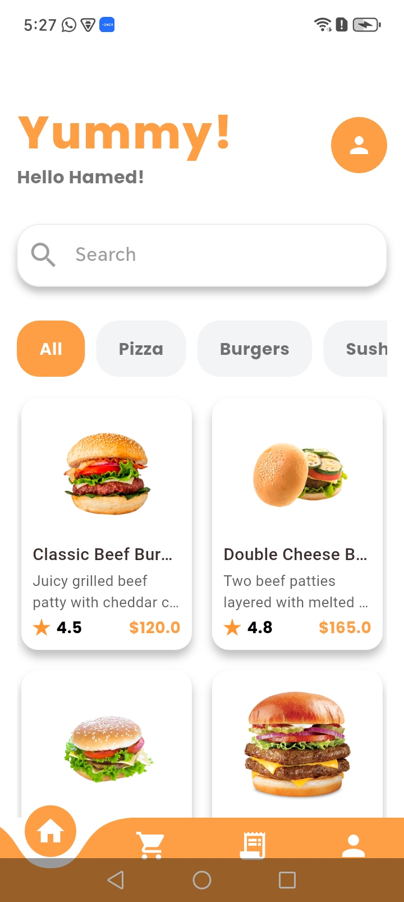
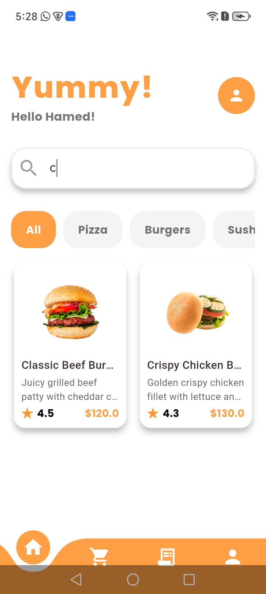
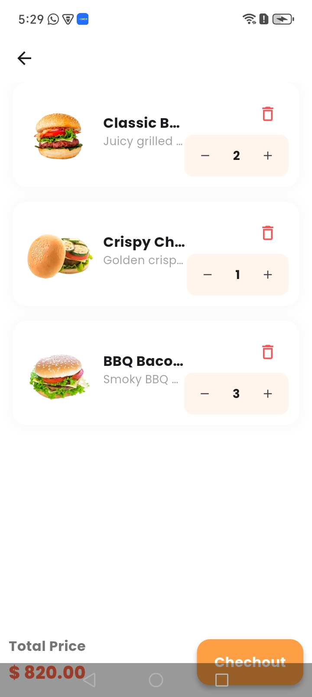
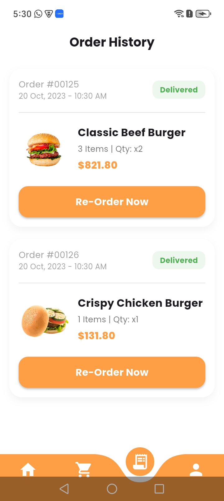
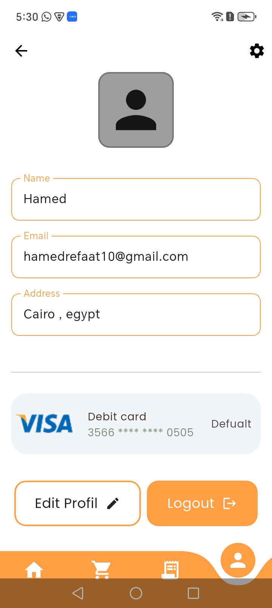
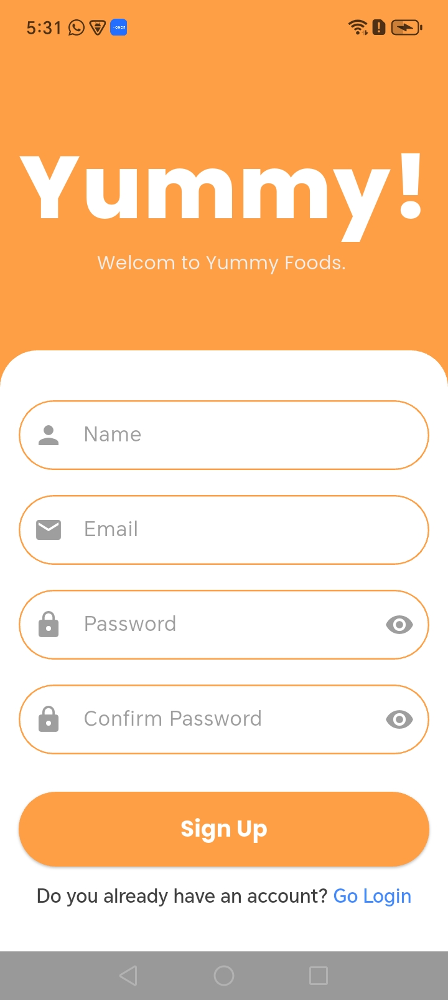
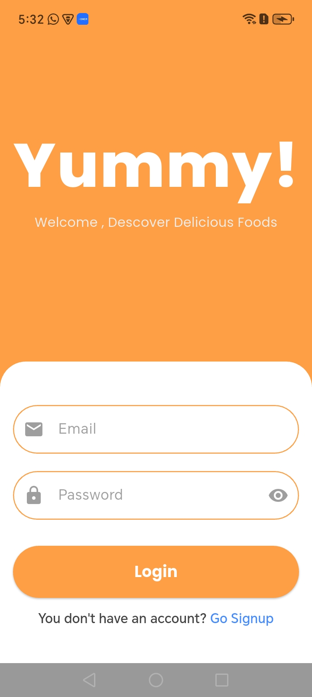

<div align="center">


# 🍔 Yummy — Food Ordering App

**A beautifully crafted Flutter food ordering application built with Clean Architecture**

[](https://flutter.dev)
[](https://dart.dev)
[](https://github.com/hamedrefaat1/Yummy_app)

</div>

---

## 📱 Overview

**Yummy** is a full-featured food ordering mobile application built with Flutter. It allows users to browse a rich menu of food products, search for items, add them to a cart, review their order history, and complete the checkout process — all wrapped in a clean and intuitive UI.

The app was developed using **Clean Architecture** principles, ensuring separation of concerns, scalability, and maintainability. It integrates with a **REST API** for live data and gracefully falls back to **dummy/mock data** when the API is unavailable — keeping the experience seamless at all times.

---

## 📸 Screenshots


<div align="center">

| Home | Product Details | Search |
|------|----------------|--------|
|  |  |  |

| Cart | Checkout | Order History |
|------|----------|--------------|
|  |  |  |

| Profile | Splash | Signup | Login |
|---------|--------|--------|-------|
|  |  |  |  |

</div>

---

## ✨ Features

- 🏠 **Home Screen** — Browse featured and categorized food products with a rich, scrollable layout
- 🔍 **Search** — Quickly find any food item by name or category
- 🛒 **Cart** — Add, remove, and manage items before placing an order
- ✅ **Checkout** — Smooth checkout flow to complete your order
- 📦 **Order History** — View all previous orders at a glance
- 👤 **Profile** — Display user information and account details
- 🔐 **Authentication** — Login and registration flow
- 🌐 **REST API Integration** — Fetches live data from a backend API
- 🧪 **Dummy Data Fallback** — Mock data is used when the API is unavailable, ensuring the app always works
- 💾 **Local Storage** — Persists user session and preferences using local storage

---

## 🏗️ Architecture

Yummy follows **Clean Architecture** with a feature-first folder structure:

```
lib/
├── core/
│   ├── constants/
│   │   ├── api_endpoints.dart       # All API endpoint constants
│   │   └── app_colors.dart          # App color palette
│   ├── networks/                    # Network layer (Dio / HTTP client setup)
│   └── utils/
│       └── local_storage.dart       # SharedPreferences / local data handler
│
├── features/
│   ├── auth/                        # Login & Registration
│   ├── home/                        # Home screen & product listing
│   ├── product_details/             # Single product view
│   ├── cart/                        # Shopping cart
│   ├── checkout/                    # Order placement flow
│   └── orderHistory/                # Past orders
│
├── shared/
│   ├── custom_button.dart
│   ├── custom_snakbar.dart
│   ├── custom_text.dart
│   ├── custom_textForm.dart
│   └── yummy_logo.dart
│
├── main.dart
├── root.dart
└── splash.dart
```

---

## 🛠️ Tech Stack

| Technology | Purpose |
|------------|---------|
| **Flutter** | Cross-platform UI framework |
| **Dart** | Programming language |
| **Clean Architecture** | Layered code structure (Data / Domain / Presentation) |
| **REST API** | Live backend data fetching |
| **Dummy/Mock Data** | Fallback when API is unavailable |
| **Local Storage** | Session & preferences persistence |
| **Custom Widgets** | Reusable UI components (buttons, text fields, snackbars) |

---

## 🚀 Getting Started

### Prerequisites

- [Flutter SDK](https://flutter.dev/docs/get-started/install) `>=3.0.0`
- [Dart SDK](https://dart.dev/get-dart) `>=3.0.0`
- Android Studio / VS Code with Flutter extension

### Installation

1. **Clone the repository**
   ```bash
   git clone https://github.com/hamedrefaat1/Yummy_app.git
   cd Yummy_app
   ```

2. **Install dependencies**
   ```bash
   flutter pub get
   ```

3. **Run the app**
   ```bash
   flutter run
   ```

> **Note:** If the API is unavailable, the app will automatically switch to dummy/mock data so you can still explore all features.

---

## 📡 API & Dummy Data

The app is designed to work with a REST API defined in `lib/core/constants/api_endpoints.dart`. All network requests are handled through the `networks` layer in the core module.

Since the API may occasionally be unavailable during development, **dummy data** has been added as a fallback across all features. This ensures:
- The UI is always testable
- All screens remain functional during demos
- Development can continue without a live backend

---

## 📂 Project Structure Highlights

| Folder | Description |
|--------|-------------|
| `lib/core/constants` | App-wide constants (colors, API endpoints) |
| `lib/core/networks` | HTTP client configuration & interceptors |
| `lib/core/utils` | Utility helpers (local storage, etc.) |
| `lib/features/*` | Individual feature modules (auth, home, cart, etc.) |
| `lib/shared` | Reusable widgets shared across features |
| `screenshots/` | App screenshots for documentation |
| `test/` | Unit and widget tests |

---
## 🎥 Demo
[▶️ Watch Demo]([https://bit.ly/3OtyKfl](https://drive.google.com/file/d/1Vm9uMu5fRSsh8MFPLibVhpDwtaMS2R2U/view?usp=sharing))

---
## 🤝 Contributing

Contributions are welcome! Feel free to fork the repo, open issues, or submit pull requests.

1. Fork the project
2. Create your feature branch: `git checkout -b feature/AmazingFeature`
3. Commit your changes: `git commit -m 'Add some AmazingFeature'`
4. Push to the branch: `git push origin feature/AmazingFeature`
5. Open a Pull Request

---

## 👨‍💻 Author

**Hamed Refaat**

[](https://github.com/hamedrefaat1)

---


<div align="center">

Made with ❤️ using Flutter

</div>
